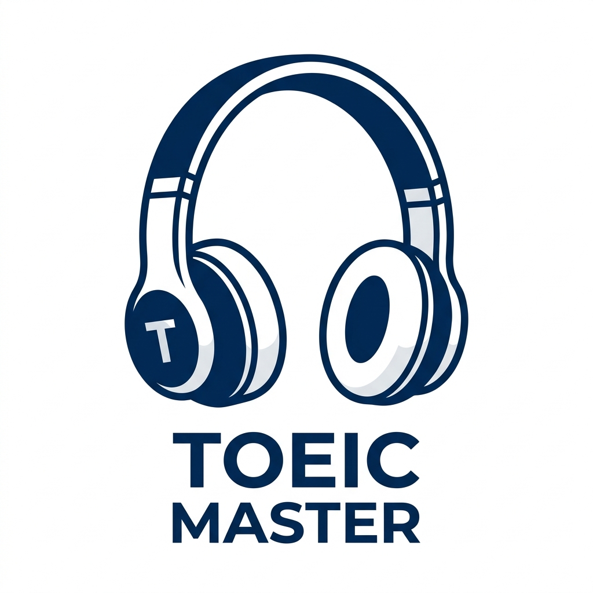

# TOEIC Listening Master 🎧

TOEIC Listening Master là một nền tảng ứng dụng web (Static Web App / PWA) hỗ trợ luyện tập nghe TOEIC một cách chuyên nghiệp, tiện lợi và hoàn toàn chạy ngoại tuyến (Offline) ngay trên trình duyệt của bạn.

## 🌟 Tính Năng Nổi Bật

- **Luyện tập toàn diện:** Hỗ trợ luyện nghe theo Full Test hoặc luyện Chuyên Sâu (Intensive) từng Part (từ Part 1 đến Part 4).
- **Trình phát Audio thông minh:** Cho phép lặp lại (Loop), chỉnh tốc độ phát (0.75x - 1.5x) và tính năng phân tích luyến âm (Liaison).
- **Chế độ Podcast thụ động:** Luyện nghe trong lúc làm việc khác với nhạc nền Lofi thư giãn, âm thanh tự động chuyển bài.
- **Tương tác linh hoạt (Hide Mode):** Tính năng ẩn bớt một số từ trong Transcript để luyện tập độ nhạy bén của tai (nghe điền từ). Click trực tiếp vào từ để băng tự động tua đến đúng vị trí đọc.
- **Sổ tay Điểm mù (Sniper Vault):** Lưu trữ lại các câu nghe sai, từ vựng khó để ôn tập lại sau. Dữ liệu được lưu an toàn cục bộ (IndexedDB).
- **Responsive & PWA:** Giao diện co giãn cực đẹp trên cả máy tính lẫn điện thoại. Hỗ trợ "Install" thành App độc lập trên thiết bị. Không cần mạng.

## 🚀 Cách Sử Dụng

Vì đây là một ứng dụng tĩnh 100% (Vanilla JS/HTML/CSS), bạn không cần cài đặt bất kỳ môi trường lập trình nào.

1. Tải toàn bộ mã nguồn về máy.
2. Click đúp chuột vào file `index.html` để mở trang web bằng trình duyệt.
3. Hoặc bạn có thể đẩy thẳng repository này lên GitHub Pages để sử dụng mọi lúc mọi nơi.

---

## ⚠️ Tuyên Bố Miễn Trừ Trách Nhiệm (Disclaimer)

> **MỤC ĐÍCH HỌC TẬP CÁ NHÂN**

- Dự án này được thiết kế và xây dựng **DUY NHẤT cho mục đích học tập cá nhân**, nhằm nâng cao kỹ năng nghe tiếng Anh và rèn luyện kỹ năng vibe lập trình web.
- **TUYỆT ĐỐI KHÔNG** sử dụng mã nguồn, dữ liệu âm thanh, hoặc hình ảnh trong repository này vào bất kỳ **mục đích thương mại, trục lợi, hoặc kinh doanh** nào.
- Dữ liệu nghe/đọc (nếu có) thuộc về bản quyền của các đơn vị sở hữu bài thi TOEIC gốc (VD: ETS). Tác giả của repository này không sở hữu bản quyền nội dung bài thi và sẽ không chịu trách nhiệm trước bất kỳ hành vi vi phạm bản quyền hay sử dụng sai mục đích nào từ phía người dùng thứ ba.

---
*Happy Studying! Chúc bạn đạt được điểm số TOEIC như mong muốn!* 💯
